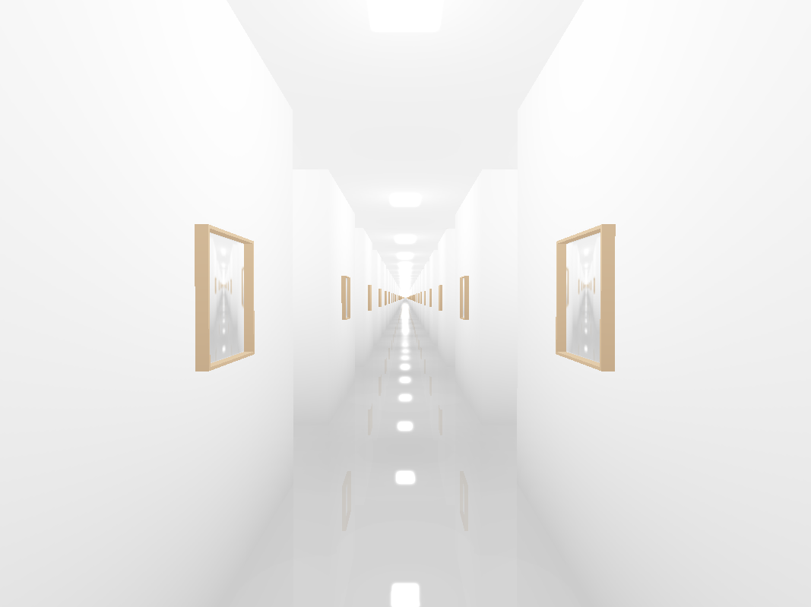

# Gallery of Babel

The Gallery of Babel is a virual gallery that contains a copy of every image that will ever exist, as long as that image has size 256x256 pixels.
It contains more than 10473479 images, way more than atoms there are in the universe! It even has a picture of you and I together, whoever you are!